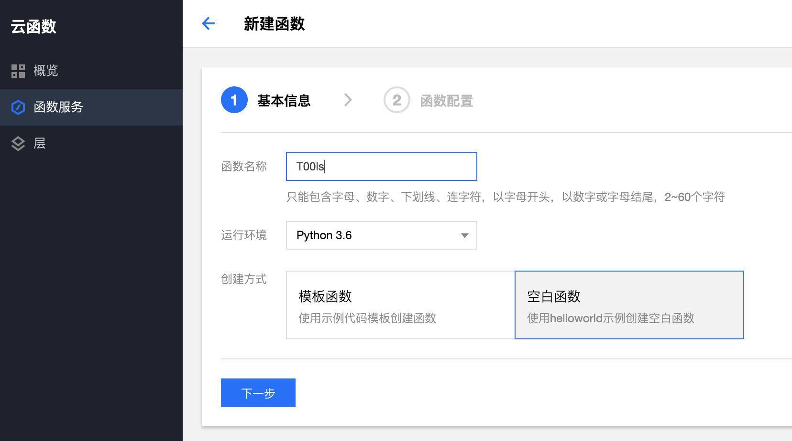
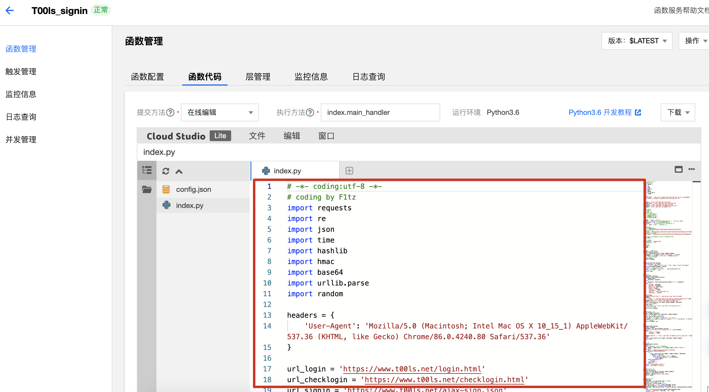
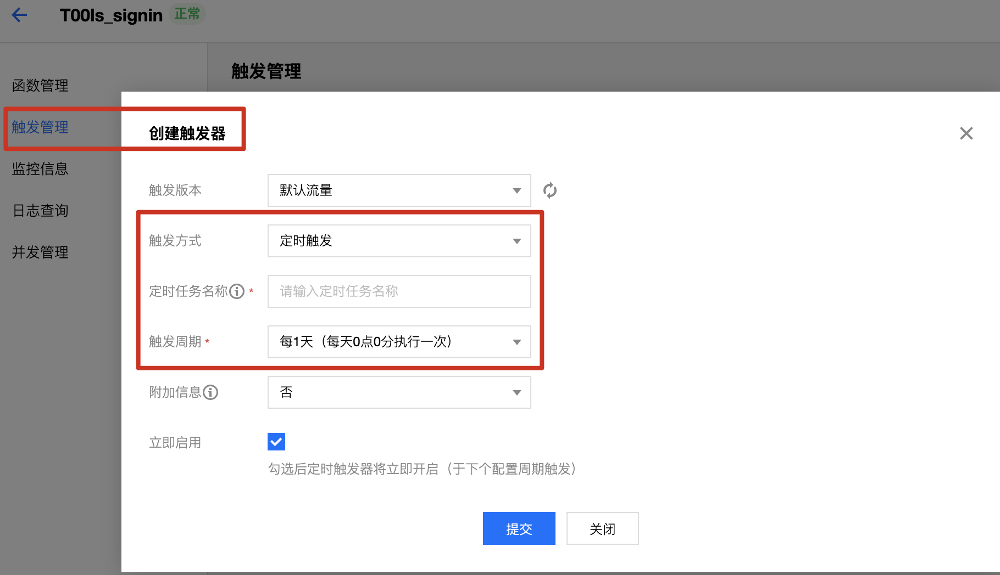
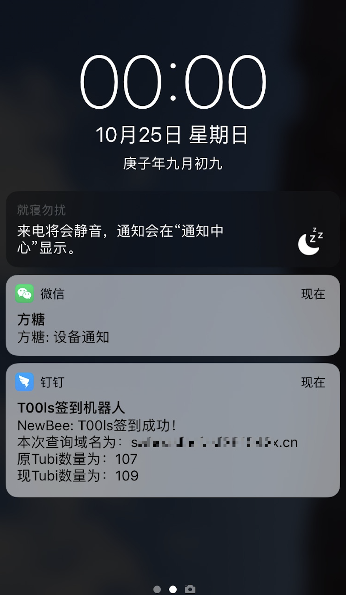

# 2Tubi
T00ls每日签到+域名查询脚本，每日可获取2Tubi

# 脚本配置

修改脚本的前部的一些变量为自己的信息

Server酱、Dingding机器人的Key申请方法可以自己搜索

```python

# #####配置项开始#######

# questionid
# 1 母亲的名字
# 2 爷爷的名字
# 3 父亲出生的城市
# 4 您其中一位老师的名字
# 5 您个人计算机的型号
# 6 您最喜欢的餐馆名称
# 7 驾驶执照的最后四位数字

username = ''  # 用户名
password = ''  # 明文密码或密码MD5
password_hash = True  # 密码为md5时设置为True
questionid = ''  # 问题ID，参考上面注释，没有可不填
answer = ''  # 问题答案，没有可不填

# 配置各种key
# Server酱申请的skey
SCKEY = ''
# Webhook加签秘钥
secret_key = ''
# Webhook access_token
access_token = ''

# 配置通知方式 0=dingding 1=weixin 2=dd+wx一起通知
notice_type = 2

# 配置查询域名前缀后缀
domain_prefix = ''  # 前缀如：sabcsadfsafsf
domain_suffix = ''  # 后缀如：xyz.cn

# #####配置项结束#######

```

## 配置域名前后缀说明

域名查询会在前后缀中间添加6位随机数字，如使用下面的配置，会查询`sabcsadfsafsf456456xyz.cn` 、 `sabcsadfsafsf123123xyz.cn`此类


```python

domain_prefix = 'sabcsadfsafsf'
domain_suffix = 'xyz.cn' 

```

# 腾讯云函数配置

1、登录腾讯云，打开云函数服务
https://console.cloud.tencent.com/scf

2、新建函数，并粘贴配置好的Python代码，之后保存





3、创建触发器，设置每天0点运行一次



# 签到效果展示

同时推送Dingding和Server酱



